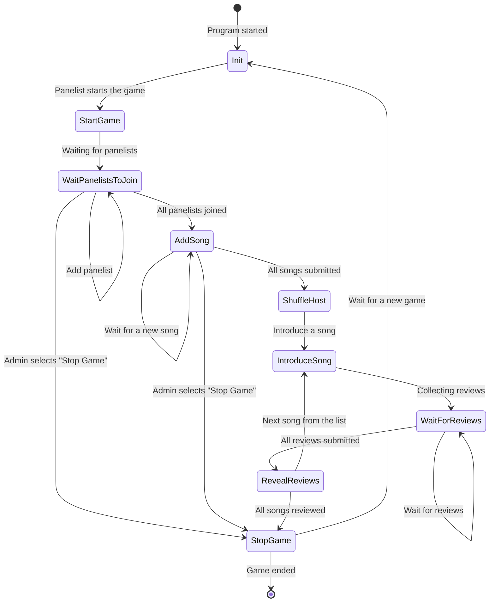

# Jukebox Jury Telegram bot

## Description

Jukebox Jury Telegram bot curates [a Jukeboxjury](https://en.wikipedia.org/wiki/Juke_Box_Jury)
gameshow round.

### Program flow

At the beginning panelists introduce songs for the bot and bot shuffles the playing order.
Then, each panelist reviews the introduced song and eventually when everything has been reviewed,
bot generates an HTML page of the results.

Flow states are depicted below:



## Dependencies

* Telegram
* GNU Make
* Go 1.23?

## Build & configuration

### Build

On the repostirory root:

```sh
make -C cmd/
```

An example configuration is located in [./env_example](./env_example) file.
Copy that into `.env` file and edit to match with your settings.

Variable explanations:

| Name              | Explanation                           |
| ----------------- | ------------------------------------- |
| BOT_API_TOKEN     | Telegram bot API token                |
| CHAT_ID           | Channel where to send public messages |
| RESULTS_DIRECTORY | Directory where to save result HTMLs  |
| RESULTS_URL       | Prefix for the results URL            |

### Running

Run the program and use the configration file `.env` found in the same directory

```sh
./cmd/dist/jukeboxjury -f .env
```
